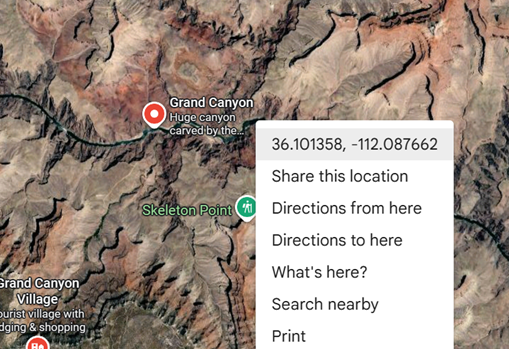
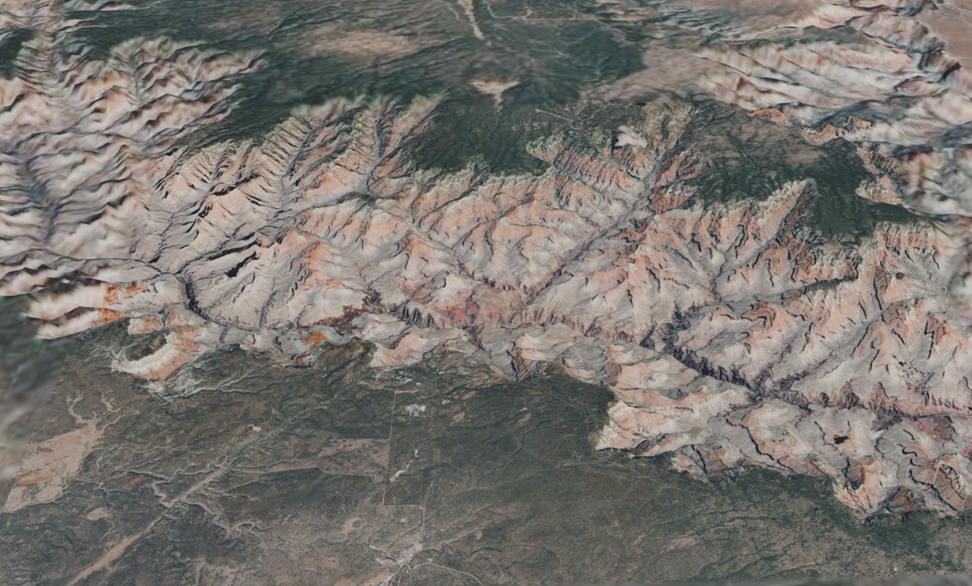

# PTerrain add-on for Blender

Generate real-world terrain meshes with progressive level of detail.

Copyright (C) 2026 Henrik Engström

[Mount Matterhorn](https://en.wikipedia.org/wiki/Matterhorn) - generated with PTerrain.

## Introduction
This add-on generates terrain mesh objects using elevation and map data from public data sources. Given a center point in latitude/longitude, a simple click generates a vast terrain mesh around the center point. The level of detail is highest at the center point for both elevation and map data, and falls off the further out the mesh extends. One intended use is creating point-of-view renderings from near the center point, where the fall-off in level of detail have very minor effect on the quality of the final render result.

This add-on is avaliable completely free, but should you find it useful and would like to encourage further development any small donation is greatly appreciated. [__- Donate using PayPal -__](https://www.paypal.com/donate/?business=9CC4TT4UCW526&no_recurring=1&currency_code=EUR)

## Basic usage

[Prerequisites before first use](doc/installation.md)

The easiest way to get started is by first selecting a center point using Google Maps. Just start a web browser and go to <http://google.com/maps> and navigate to a point of interest. Right-click at the point, and select the given coordinates in latitude/longitude. 

\

Go to the PTerrain panel in Blender and paste the coordinates into the lat/lon field.

\

Press 'Generate', and after a while the mesh will be displayed. Note that if you selected a point with high altitude, you might need to zoom out quite a bit before seeing the mesh in the viewport. Switch to Material preview to see the map data.

\

__Tip:__ If you generated meshes and then deletes them, some dangling data is still stored within the Blender file. Use 'File->Clean Up->Purge Unused Data...' to fully delete the unused data.

# Documentation
- [Add-on installation](doc/installation.md)
- [Parameters](doc/parameters.md)
- [Data sources](doc/data-sources.md)
- [Performance](doc/performance.md)

