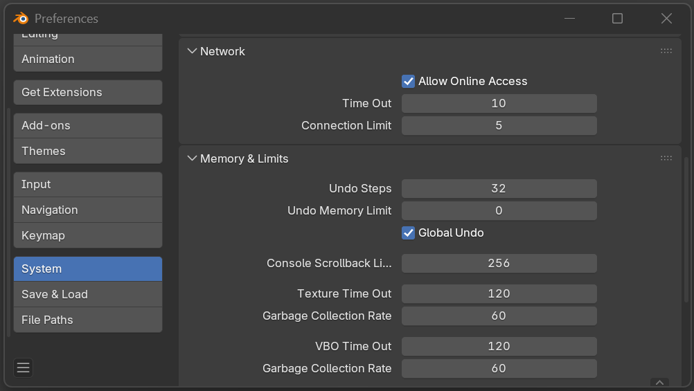

# PTerrain - Installation

To install the PTerrain add-on you must first download the latest release zip-file from the [Releases](https://github.com/henrike586/pterrain/releases) page.

Then follow the general instructions in this [Youtube video](https://www.youtube.com/watch?v=OCTvyo2FVFw).

PTerrain requires Internet access for downloading from public data sources. Ensure internet access is enabled in Blender preferences under 'System->Allow Online Access'.

---

### [Main page](../README.md)
- [Add-on installation](./installation.md)
- [Parameters](./parameters.md)
- [Data sources](./data-sources.md)
- [Performance](./performance.md)
