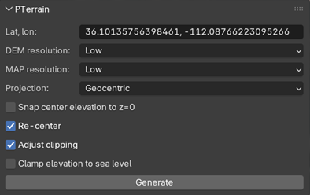
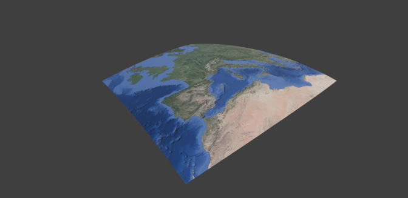
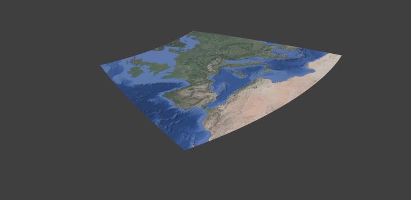
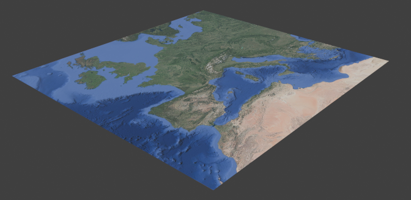
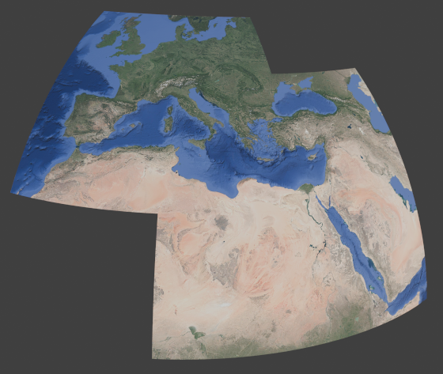

# PTerrain - Parameters

## PTerrain Blender panel

## Parameters
### Lat, lon
The center point of the generated terrain in latitude/longitude. Use a comma to separate the two values. Enter a known position, or use the Google Maps-method described in [Basic usage](../README.md#basic-usage).

### DEM and MAP resolution
Select from three different resolution (quality) presets; Low / Medium / High. Selecting a higher preset will increase file sizes and generation times, see [Performance](./performance.md). It is recommended to start with a low preset, and the increase if needed. The DEM/MAP resolution presets can be selected independently.

### Projection
#### Geocentric
The Geocentric projection creates a 3D terrain mesh wrapped around the globe (a sphere) in 1:1 scale.

#### Orthographic
The [Orthographic](https://en.wikipedia.org/wiki/Orthographic_map_projection) projection creates a 2D terrain mesh, and distances are fairly correct at the center point.

#### Web Mercator
The [Web Mercator](https://en.wikipedia.org/wiki/Web_Mercator_projection) projection creates a 2D terrain mesh, which matches the downloaded tile format. Distances are not correct anywhere except near the equator.

### Snap center elevation to z=0
If this setting is checked, the elevation data is adjusted (lowered) so that the elevation at the origin is zero. If it is unchecked, the elevation data is untouched (raw).

### Re-center
If this setting is checked, a generated mesh will have its center point at Blenders origin. If it is unchecked, the last center point will not move. The use case for this feature is when one wants to generate multiple terrain meshes with different center points, and they shall align correctly. To do this, generate the first terrain mesh with this setting checked. Then uncheck it before generating the following meshes. Below is a picture with two generated meshes using this method.

### Adjust clipping
The default viewport clipping (0.01m / 1000m) is too restricted to view the generated terrain objects in full. If this setting is checked, the viewport clipping will be adjusted to 100m / 10000km. Adjust the viewport and camera clipping before doing final renderings.

### Clamp elevation to sea level
If this setting is checked, all data points with an elevation below zero is clamped to zero. The elevation data in water regions sometimes represents the sea bottom - use this setting to get a flat sea surface.

### Generate
Press the button to start generation of the terrain mesh using the current settings.

---

### [Main page](../README.md)
- [Add-on installation](./installation.md)
- [Parameters](./parameters.md)
- [Data sources](./data-sources.md)
- [Performance](./performance.md)
